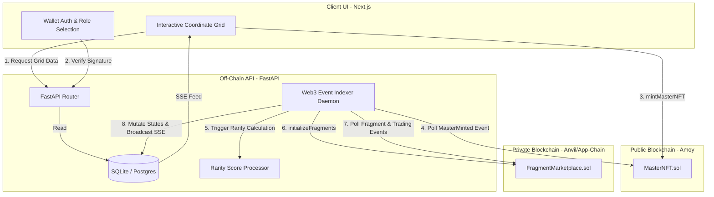

# iHeritage: Hybrid Fractional NFT Marketplace

iHeritage is a **Fractional Heritage NFT Marketplace** designed to bridge the security of public blockchains with the high performance and low costs of private app-chains. The system allows museums to tokenize physical cultural artifacts into unique coordinate-mesh digital fragments (Fractional NFTs) for gasless trading, while anchoring provenance and authenticity on a public blockchain.

---

## 1. System Architecture

The project consists of three decoupled layers that coordinate via an asynchronous event indexer:

1. **Public Anchoring Layer (Blockchain)**: Mints and holds the Master NFT representing full artwork provenance and authenticity proofs (Polygon Amoy / Sepolia).
2. **Private Trading Layer (Blockchain)**: Gasless, high-frequency layer for minting coordinate fragments, listing items on order books, bidding, and handling escrow accounts.
3. **Off-Chain indexing & API Layer**: A FastAPI python service that indexes blockchain events, calculates fragment rarity matrices, caches metadata, and broadcasts SSE updates to clients.
4. **Client Dashboard (Next.js)**: A responsive Web3 portal featuring interactive coordinate grids, live notification feeds, wallet auth portals, and collector vaults.

### System Architecture Flow



---

## 2. Repository Directory Structure

```text
├── contracts/           # Smart Contracts (Foundry Project)
│   ├── src/             # Solidity Source Code
│   │   ├── MasterNFT.sol             # Public Anchor ERC-721 Contract
│   │   └── FragmentMarketplace.sol    # Trading Layer ESCROW & Bidding Contract
│   ├── script/          # Deployment Scripts
│   │   └── DeployAll.s.sol           # Core Dual-Layer Deployment script
│   ├── test/            # Foundry Unit Tests
│   └── foundry.toml     # Foundry configuration (Solidity 0.8.31, Optimizer Enabled)
│
├── backend/             # Relayer, Rarity Processing, & Event Indexer (FastAPI)
│   ├── app/
│   │   ├── main.py      # FastAPI server routes, SSE notification engines
│   │   ├── database.py  # SQLAlchemy database setup & ORM configurations
│   │   ├── models.py    # Relational Schemas (Artworks, Fragments, Listings, Bids)
│   │   ├── indexer.py   # Asynchronous Web3.py daemon polling blocks and logs
│   │   └── rarity.py    # Localized coordinates rarity calculation algorithms
│   └── requirements.txt # Python dependencies (fastapi, uvicorn, web3, sqlalchemy)
│
├── frontend/            # Client Dashboard (Next.js 16.2 App Router)
│   ├── src/app/         # Public pages, Collector vaults, and Museum portals
│   ├── src/components/  # Layout dividers, Dev network toggles, loading animations
│   ├── src/config/      # Contract address configurations & network registries
│   └── package.json     # Node scripts and dependencies (Wagmi, Viem, Ethers)
│
├── run_dev_all.sh       # Unified local environment startup bash script (Linux/macOS)
├── run_dev_all.ps1      # Unified local environment startup PowerShell script (Windows)
├── package.json         # Root npm script runner shortcut
└── README.md            # This documentation file
```

---

## 3. Prerequisites

Ensure you have the following installed on your machine:
* **Node.js (v18+)** & npm
* **Python (3.10+)** & `venv`
* **Foundry/Anvil**: The Solidity compiler and local test node engine.
  * If not installed, run: `curl -L https://foundry.paradigm.xyz | bash` and then `foundryup`.

---

## 4. First-Time Setup

Run the following commands in your terminal to initialize virtual environments and download dependencies.

### A. Initialize Backend Virtual Environment & Install Libraries
```bash
cd backend
# Create Python virtual environment
python3 -m venv .venv
# Activate virtual environment
source .venv/bin/activate  # On Linux/macOS
.venv\Scripts\activate   # On Windows (Git Bash)
# Install dependencies
pip install -r requirements.txt
cd ..
```

### B. Install Frontend Packages
```bash
cd frontend
npm install
cd ..
```

---

## 5. Local Runtime Execution (Single Command Startup)

To run the entire system locally (including starting two blockchain instances, deploying contracts, booting the backend database, and serving the frontend):

```bash

# On Linux / macOS:
# Grant execution permissions (one-off)
chmod +x run_dev_all.sh

# Start the unified local environment
./run_dev_all.sh

# On Windows (PowerShell):
# Start the unified local environment
.\run_dev_all.ps1
# (Note: If ExecutionPolicy blocks execution, run: Set-ExecutionPolicy -Scope Process -ExecutionPolicy Bypass)
```

### What happens behind the scenes?
1. Stops any conflicting background instances of Anvil or FastAPI.
2. Purges the local SQLite database (`backend/iheritage.db`) and mock IPFS files to ensure a clean slate.
3. Launches **Public Anvil Node** (Port `8547`, Chain ID `31338`).
4. Launches **Private Anvil Node** (Port `8546`, Chain ID `9999`).
5. Compiles and Deploys contracts dynamically, writing fresh addresses to `contracts/deployed_addresses.json`.
6. Launches the **FastAPI Backend Server** (Port `8000`), which automatically imports the fresh addresses.
7. Launches the **Next.js Frontend Server** (Port `3000`).

**PAY ATTENTION: You must disconnect the wallet and Delete activity and nonce data in Developer tools of MetaMask for each time running the script.

*Press **`Ctrl + C`** in the terminal to cleanly terminate all background servers simultaneously.*

---

## 6. Local Testing Wallets & Network Config

Anvil pre-funds several testing accounts with 10,000 ETH. Run this command to get the private keys of all accounts:

```bash
cast wallet private-key --mnemonic "test test test test test test test test test test test junk" --mnemonic-index <account-index>
```
where `<account-index>` is the index of the account you want to get the private key of (0, 1, 2, ...).  

Then, you install and setup MetaMask on your browser, add a new **wallet** by using private key.

### Add MetaMask Custom RPC Networks
To interact with local blockchains using your browser wallet, add these two custom RPC networks in MetaMask (it may automatically ask you to add the network when connecting to the frontend):

1. **Anvil Public Anchor**:
   * RPC URL: `http://127.0.0.1:8547`
   * Chain ID: `31338`
   * Currency Symbol: `ETH`
2. **Anvil Private Trading**:
   * RPC URL: `http://127.0.0.1:8546`
   * Chain ID: `9999`
   * Currency Symbol: `ETH`

---
